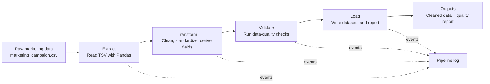

# Marketing Campaign Data Pipeline

> A modular Python and Pandas ETL pipeline that transforms, validates, and reports on marketing campaign data.


## Overview

This project is a practical Extract, Transform, Validate, Load (ETL) pipeline built with Python and Pandas. It processes a tab-separated marketing campaign dataset and produces a cleaned dataset, a data-quality report, and runtime logs for downstream analysis.

The pipeline includes:

- CSV extraction with error handling
- Date and text cleaning
- Category normalization
- Derived analytical fields
- Data-quality flags and validation rules
- An automated quality report
- File-based pipeline logging

## Pipeline Architecture



## ETL Stages

### 1. Extract

The extraction stage reads the source file as a tab-separated CSV and records the row and column counts. It handles missing files and CSV parsing errors.

```python
df = pd.read_csv(
    dataset_path,
    sep="\t"
)
```

### 2. Transform

The transformation stage prepares raw data for analysis and validation.

#### Date conversion

Customer registration dates are converted to Pandas datetime values. Invalid dates become missing values so they can be identified during validation.

```python
df["Dt_Customer"] = pd.to_datetime(
    df["Dt_Customer"],
    format="%d-%m-%Y",
    errors="coerce"
)
```

#### Education and marital-status cleaning

Education values are stripped, standardized, and corrected where needed. Selected uncommon marital-status values are consolidated into `Single`.

```python
df["Education"] = (
    df["Education"]
    .str.strip()
    .str.title()
)
df["Education"] = df["Education"].replace({"Phd": "PhD"})

df["Marital_Status"] = df["Marital_Status"].str.strip()
df["Marital_Status"] = df["Marital_Status"].replace({
    "Alone": "Single",
    "YOLO": "Single",
    "Absurd": "Single",
})
```

#### Derived analytical columns

The pipeline creates fields that make the data easier to analyse, including customer enrolment year and month, household children, and total product spending.

```python
df["Customer_Year"] = df["Dt_Customer"].dt.year
df["Customer_Month"] = df["Dt_Customer"].dt.month

df["Total_Children"] = df["Kidhome"] + df["Teenhome"]

df["Total_Spending"] = (
    df["MntWines"]
    + df["MntFruits"]
    + df["MntMeatProducts"]
    + df["MntFishProducts"]
    + df["MntSweetProducts"]
    + df["MntGoldProds"]
)
```

#### Data-quality flags

Flags make potentially problematic records visible without removing them from the dataset.

```python
df["Income_Missing"] = df["Income"].isna()

df["Birth_Year_Invalid"] = (
    (df["Year_Birth"] < 1900)
    | (df["Year_Birth"] > 2026)
)

df["Income_Suspicious"] = df["Income"] == 666666
```

### 3. Validate

The validation stage checks the transformed dataset for:

- Invalid customer dates and negative incomes
- Birth years outside the expected range (1900–2026)
- Invalid `Kidhome` and `Teenhome` values
- Incorrect total-children calculations
- Negative total spending
- Suspicious income values
- Non-binary campaign-response values

Campaign response columns must contain `0` or `1`. The reusable helper below counts values outside that allowed set.

```python
def validate_allowed_values(df, column, allowed_values):
    invalid_count = (
        ~df[column].isin(allowed_values)
    ).sum()

    return invalid_count
```

### 4. Load

The load stage saves the cleaned dataset and its quality report as CSV files.

```python
df.to_csv(output_dataset, index=False)
quality_report.to_csv(quality_report_path, index=False)
```

## Data-Quality Report

After validation, the pipeline creates a structured report with one row per rule. The current sample output is:

| Rule | Failed rows |
| --- | ---: |
| Invalid Income | 0 |
| Invalid Customer Dates | 0 |
| Invalid Birth Years | 2 |
| Invalid Kidhome | 0 |
| Invalid Teenhome | 0 |
| Incorrect Total Children | 0 |
| Invalid Total Spending | 0 |
| Suspicious Income | 1 |
| Invalid Campaign Values | 0 |

The dataset status is `PASS` when every rule has zero failed rows; otherwise, it is `REVIEW REQUIRED`.

## Logging

Python’s built-in `logging` module records key events, including extraction results, transformation completion, validation warnings, output locations, and pipeline completion.

Example log entries:

```text
2026-08-27 19:18:50 | INFO | Pipeline started.
2026-08-27 19:18:50 | INFO | Data extracted successfully.
2026-08-27 19:18:50 | INFO | Rows: 2240
2026-08-27 19:18:50 | INFO | Columns: 29
```

Runtime logs are written to `logs/pipeline.log`. This directory is excluded from version control because logs are generated at runtime.

## Input and Outputs

| Type | Path | Description |
| --- | --- | --- |
| Input | `datasets/marketing_campaign.csv` | Raw, tab-separated marketing campaign data |
| Output | `datasets/marketing_campaign_cleaned.csv` | Cleaned dataset with derived fields and quality flags |
| Output | `datasets/data_quality_report.csv` | Validation results by rule |
| Runtime | `logs/pipeline.log` | Pipeline execution log |

## Project Structure

```text
marketing-campaign-data-pipeline/
├── datasets/
│   ├── marketing_campaign.csv
│   ├── marketing_campaign_cleaned.csv
│   └── data_quality_report.csv
├── notebooks/
│   └── exploration.ipynb
├── scripts/
│   ├── data_cleaning.py
│   └── lesson_*.py
├── etl_pipeline.py
├── requirements.txt
├── .gitignore
└── README.md
```

## Technologies and Concepts

- **Language:** Python
- **Libraries:** Pandas
- **Development tools:** Visual Studio Code, Jupyter Notebook, Python virtual environments
- **Version control:** Git and GitHub
- **Data engineering concepts:** ETL, data cleaning, transformation, validation, quality reporting, logging, and reproducible workflows

## Installation

1. Clone the repository.

   ```bash
   git clone https://github.com/michaelalbert226-lgtm/marketing-campaign-data-pipeline.git
   ```

2. Move into the project directory.

   ```bash
   cd marketing-campaign-data-pipeline
   ```

3. Create and activate a virtual environment.

   ```powershell
   python -m venv .venv
   .venv\Scripts\Activate.ps1
   ```

4. Install the dependency.

   ```bash
   pip install -r requirements.txt
   ```

## Run the Pipeline

From the project root, run:

```bash
python etl_pipeline.py
```

The pipeline runs the extract, transform, validate, and load stages, then writes the cleaned dataset and quality report to `datasets/` and runtime information to `logs/pipeline.log`.

## Main Pipeline Functions

The ETL process is organized around reusable functions:

```python
extract_data()
transform_data()
validate_allowed_values()
validate_data()
load_data()
heading()
main()
```

`main()` controls the pipeline flow:

```python
def main():
    logging.info("Pipeline started.")
    df = extract_data(DATASET)

    if df is None:
        logging.error("Pipeline stopped: extraction failed.")
        return

    df = transform_data(df)
    quality_report = validate_data(df)
    load_data(df, quality_report)

    logging.info("Pipeline completed successfully.")
```

## Current Capabilities

- Structured ETL workflow for tab-separated CSV data
- Data cleaning and categorical normalization
- Missing-value, suspicious-income, and invalid-birth-year flags
- Derived analytical fields
- Range and allowed-value validation
- Automated data-quality reporting
- Error handling and file-based logging
- CSV output generation

## Future Improvements

- Refactor the pipeline into dedicated modules
- Add automated unit tests
- Improve configuration management and validation rules
- Introduce SQL transformations and database loading
- Add orchestration, automated execution, monitoring, and observability
- Explore Apache Airflow and a layered data architecture

## Learning Objectives

This project supports practical learning in data-engineering fundamentals, Python and Pandas, ETL architecture, data quality, logging and observability, Git/GitHub, and modular, reproducible development.

## Status

**Active development.** The pipeline currently supports extraction, transformation, validation, quality reporting, logging, and processed CSV outputs.

## Author

**Michael Adamu**  
Data Engineer

Focus areas: Python, Pandas, SQL, ETL, data quality, data engineering, Git, and GitHub.

## Repository

https://github.com/michaelalbert226-lgtm/marketing-campaign-data-pipeline
